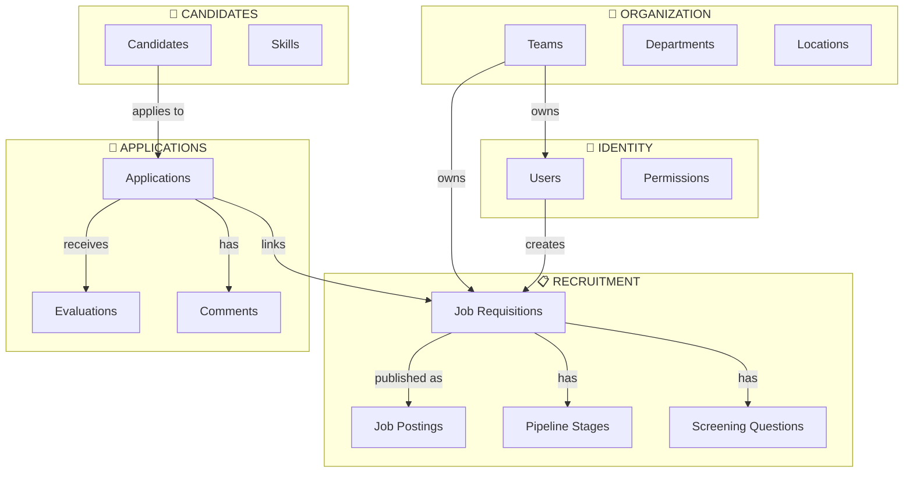

# RPQ — Recruit Party Quest

**RPQ** is a multi-tenant recruitment platform built with Laravel using **Domain-Driven Design (DDD)** and a **modular monolith** architecture.

## Core Concepts

- **Domain-Driven Design** — Explicit bounded contexts and aggregate roots
- **Multi-tenancy** — Team-based isolation as a first-class concern
- **Modular Monolith** — Self-contained modules under `app-modules/`
- **Auditability** — Full activity logging and history tracking

---

## Modules

| Module           | Description                                         | Documentation                                   |
| ---------------- | --------------------------------------------------- | ----------------------------------------------- |
| **Users**        | User accounts, authentication, profiles             | [📖 README](app-modules/users/README.md)        |
| **Teams**        | Organizations, departments, team membership         | [📖 README](app-modules/teams/README.md)        |
| **Permissions**  | RBAC via Spatie, roles and permissions              | [📖 README](app-modules/permissions/README.md)  |
| **Location**     | Polymorphic addresses for entities                  | [📖 README](app-modules/location/README.md)     |
| **Recruitment**  | Job requisitions, postings, pipeline stages         | [📖 README](app-modules/recruitment/README.md)  |
| **Screening**    | Screening questions and knockout logic              | [📖 README](app-modules/screening/README.md)    |
| **Candidates**   | Candidate profiles, skills, education, work history | [📖 README](app-modules/candidates/README.md)   |
| **Applications** | Application lifecycle, stage transitions, offers    | [📖 README](app-modules/applications/README.md) |
| **Feedback**     | Evaluations, ratings, and comments                  | [📖 README](app-modules/feedback/README.md)     |
| **Panel Admin**  | Filament admin panel for system management          | [📖 README](app-modules/panel-admin/README.md)  |

> Modules prefixed with `panel-` are **Filament-based UIs**

---

## Architecture Overview



---

## Quick Start

```bash
make setup          # Install dependencies
make env-up         # Start Docker (DB, etc.)
make migrate-fresh  # Database setup with seeds
make dev            # Start Vite dev server
```

Access admin panel at `/admin` (requires SuperAdmin role).

---

## Development

### Module Structure

```
app-modules/{module}/
├── src/                    # PHP classes (Models, Policies, Enums)
├── tests/                  # Pest feature/unit tests
├── database/               # Factories, migrations, seeders
└── config/                 # Module-specific config
```

### Conventions

- **Namespace**: `He4rt\{Module}` (e.g., `He4rt\Users`)
- **Testing**: Pest v4 with factories
- **Formatting**: Laravel Pint
- **Analysis**: PHPStan + Rector

### Key Commands

| Command        | Description               |
| -------------- | ------------------------- |
| `make test`    | Run all tests             |
| `make pint`    | Format code               |
| `make phpstan` | Static analysis           |
| `make check`   | Dry-run all checks        |
| `make format`  | Apply Rector + Pint fixes |

Run `make help` for all available commands.

---

## Tech Stack

- **PHP 8.5** / **Laravel 12**
- **Filament v4** — Admin panels
- **Livewire v3** — Reactive components
- **Tailwind v4** — CSS-first styling
- **Pest v4** — Testing framework
- **Spatie Permission** — RBAC
