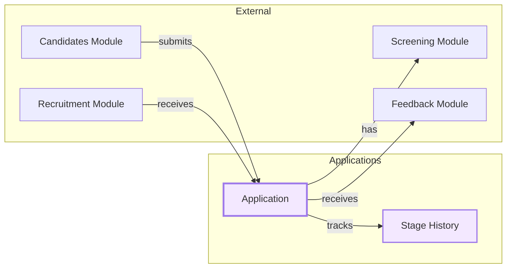
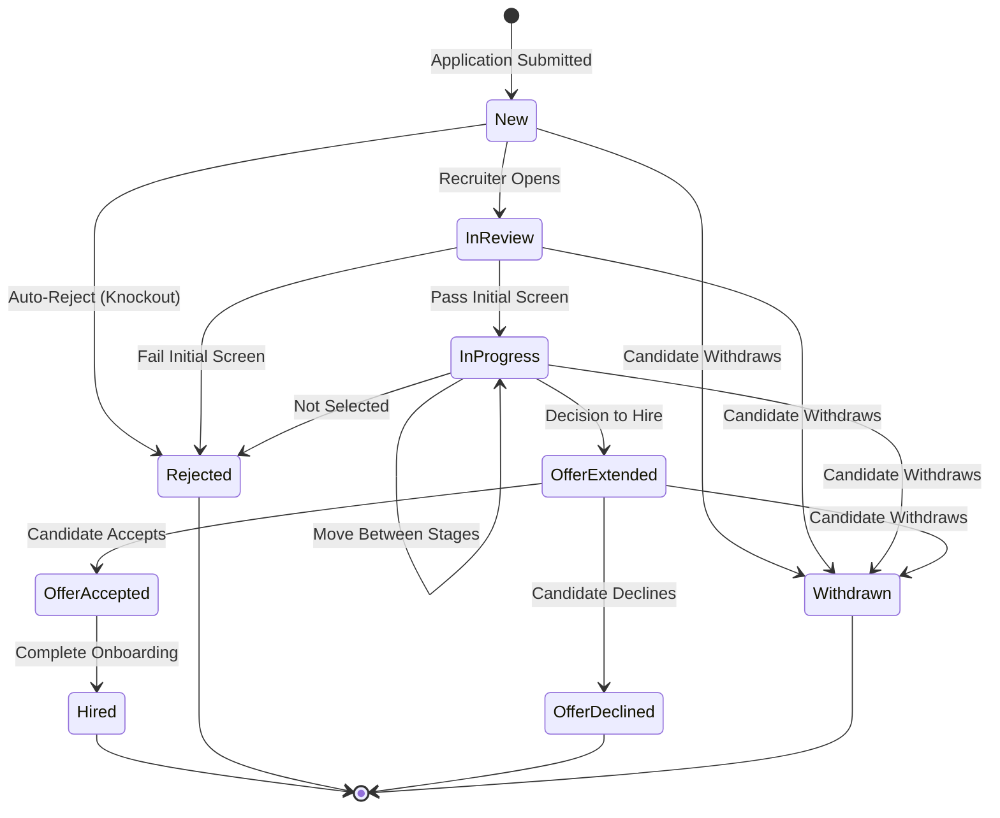

# Applications Module

## Overview

The **Applications** module manages the core workflow of job applications within the recruitment system. It tracks
candidates' applications from submission through the entire hiring pipeline, including stage transitions, offers, and
rejections.

## Context

This module serves as the central hub connecting candidates to job requisitions. It maintains the complete lifecycle of
an application, from initial submission to final disposition (hired, rejected, or withdrawn).

### Domain Position



## Models

### Application

The main entity representing a candidate's application to a specific job requisition.

| Property                    | Type                        | Description                 |
| --------------------------- | --------------------------- | --------------------------- |
| `id`                        | UUID                        | Primary key                 |
| `requisition_id`            | UUID                        | FK to job requisition       |
| `candidate_id`              | UUID                        | FK to candidate             |
| `current_stage_id`          | UUID (nullable)             | Current pipeline stage      |
| `status`                    | ApplicationStatusEnum       | Current application status  |
| `source`                    | CandidateSourceEnum         | How candidate found the job |
| `source_details`            | string (nullable)           | Additional source info      |
| `cover_letter`              | text (nullable)             | Candidate's cover letter    |
| `tracking_code`             | string (unique)             | External tracking reference |
| `rejected_at`               | timestamp (nullable)        | When rejected               |
| `rejected_by`               | UUID (nullable)             | User who rejected           |
| `rejection_reason_category` | RejectionReasonCategoryEnum | Rejection category          |
| `rejection_reason_details`  | text (nullable)             | Detailed rejection reason   |
| `offer_extended_at`         | timestamp (nullable)        | When offer was sent         |
| `offer_extended_by`         | UUID (nullable)             | User who extended offer     |
| `offer_amount`              | decimal (nullable)          | Offer compensation          |
| `offer_response_deadline`   | timestamp (nullable)        | Deadline for offer response |

**Relationships:**

- `belongsTo` JobRequisition
- `belongsTo` Candidate
- `belongsTo` Stage (currentStage)
- `belongsTo` User (rejectedBy, offerExtendedBy)
- `hasMany` ApplicationStageHistory
- `hasMany` ScreeningResponse
- `hasMany` Evaluation
- `hasMany` ApplicationComment

### ApplicationStageHistory

Audit trail tracking all stage transitions for an application.

| Property         | Type            | Description                       |
| ---------------- | --------------- | --------------------------------- |
| `id`             | UUID            | Primary key                       |
| `application_id` | UUID            | FK to application                 |
| `from_stage_id`  | UUID (nullable) | Previous stage (null for initial) |
| `to_stage_id`    | UUID (nullable) | New stage                         |
| `moved_by`       | UUID (nullable) | User who moved the application    |
| `notes`          | text (nullable) | Transition notes                  |
| `created_at`     | timestamp       | When transition occurred          |

## Enums

### ApplicationStatusEnum

```
New           → Fresh application, awaiting review
InReview      → Being reviewed by recruiter
InProgress    → Active in pipeline stages
OfferExtended → Offer sent to candidate
OfferAccepted → Candidate accepted offer
OfferDeclined → Candidate declined offer
Hired         → Successfully hired
Rejected      → Application rejected
Withdrawn     → Candidate withdrew
```

### CandidateSourceEnum

```
LinkedIn    → Found via LinkedIn
Indeed      → Found via Indeed
Glassdoor   → Found via Glassdoor
Referral    → Employee referral
CareerPage  → Company career page
Other       → Other sources
```

### RejectionReasonCategoryEnum

```
Qualifications  → Doesn't meet qualifications
Experience      → Insufficient experience
CultureFit      → Not a culture fit
Compensation    → Salary expectations mismatch
Location        → Location constraints
Availability    → Availability issues
PositionFilled  → Position already filled
Other           → Other reasons
```

## Business Rules

### Application Lifecycle



### Constraints

1. **Unique Application**: A candidate can only have one active application per requisition (
   `unique(requisition_id, candidate_id)`)
2. **Tracking Code**: Each application has a unique tracking code for external reference
3. **Stage History**: Every stage transition must be recorded in `application_stage_history`
4. **Rejection Details**: When rejecting, `rejection_reason_category` should be provided
5. **Offer Tracking**: Offer details (amount, deadline) are tracked when `OfferExtended`

### Authorization

The `ApplicationPolicy` controls:

- `viewAny`: List applications
- `view`: View specific application
- `create`: Submit new application
- `update`: Modify application details
- `delete`: Remove application
- Stage transitions and offer management

## Directory Structure

```
applications/
├── database/
│   ├── factories/
│   │   ├── ApplicationFactory.php
│   │   └── ApplicationStageHistoryFactory.php
│   └── migrations/
│       ├── 2026_01_15_200001_create_applications_table.php
│       └── 2026_01_15_200002_create_application_stage_history_table.php
├── src/
│   ├── Enums/
│   │   ├── ApplicationStatusEnum.php
│   │   ├── CandidateSourceEnum.php
│   │   └── RejectionReasonCategoryEnum.php
│   ├── Models/
│   │   ├── Application.php
│   │   └── ApplicationStageHistory.php
│   ├── Policies/
│   │   ├── ApplicationPolicy.php
│   │   └── ApplicationStageHistoryPolicy.php
│   └── ApplicationsServiceProvider.php
└── tests/
    └── Feature/
```

## TODO / Future Enhancements

- [ ] Implement application scoring/ranking system
- [ ] Add bulk application operations
- [ ] Email notifications for status changes
- [ ] Application analytics and reporting
- [ ] Integration with communication templates
- [ ] Automated stage advancement rules
