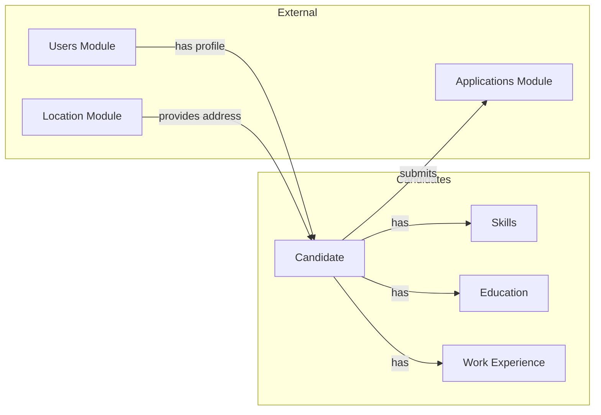
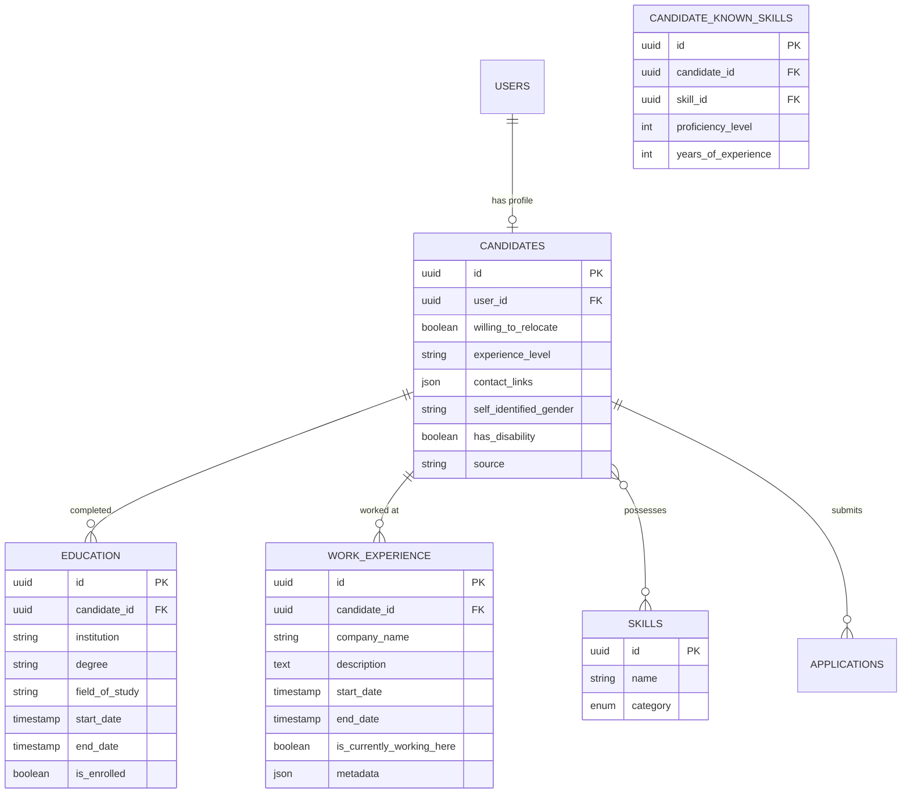

# Candidates Module

## Overview

The **Candidates** module manages candidate profiles and their professional information within the recruitment system. It stores comprehensive data about job seekers including their skills, education history, work experience, and personal preferences.

## Context

This module represents the talent pool of individuals who can apply for job positions. Each candidate is linked to a user account and can have multiple applications across different job requisitions.

### Domain Position



## Models

### Candidate

The main entity representing a job seeker's profile.

| Property                 | Type                 | Description                  |
| ------------------------ | -------------------- | ---------------------------- |
| `id`                     | UUID                 | Primary key                  |
| `user_id`                | UUID                 | FK to user account           |
| `willing_to_relocate`    | boolean              | Open to relocation           |
| `experience_level`       | string               | Overall experience level     |
| `contact_links`          | array<mixed>         | Social/contact links (JSON)  |
| `self_identified_gender` | string               | Gender identification        |
| `has_disability`         | boolean              | Disability disclosure        |
| `source`                 | string               | How they joined the platform |
| `deleted_at`             | timestamp (nullable) | Soft delete                  |

**Relationships:**

- `belongsTo` User
- `hasMany` Education (degrees)
- `hasMany` WorkExperience
- `belongsToMany` Skill (with pivot data)
- `morphOne` Address (via HasAddress trait)

### Skill

Represents a skill that candidates can possess.

| Property     | Type                   | Description |
| ------------ | ---------------------- | ----------- |
| `id`         | UUID                   | Primary key |
| `name`       | string                 | Skill name  |
| `category`   | CandidateSkillCategory | Skill type  |
| `deleted_at` | timestamp (nullable)   | Soft delete |

**Relationships:**

- `belongsToMany` Candidate

### CandidateSkill (Pivot)

Junction table with additional data for candidate-skill relationships.

| Property              | Type    | Description             |
| --------------------- | ------- | ----------------------- |
| `id`                  | UUID    | Primary key             |
| `candidate_id`        | UUID    | FK to candidate         |
| `skill_id`            | UUID    | FK to skill             |
| `proficiency_level`   | integer | Skill proficiency (1-5) |
| `years_of_experience` | integer | Years using this skill  |

### Education

Academic background entries for a candidate.

| Property         | Type                 | Description            |
| ---------------- | -------------------- | ---------------------- |
| `id`             | UUID                 | Primary key            |
| `candidate_id`   | UUID                 | FK to candidate        |
| `institution`    | string               | School/university name |
| `degree`         | string               | Degree type            |
| `field_of_study` | string               | Major/concentration    |
| `start_date`     | timestamp            | Start date             |
| `end_date`       | timestamp            | End/expected end date  |
| `is_enrolled`    | boolean              | Currently enrolled     |
| `deleted_at`     | timestamp (nullable) | Soft delete            |

### WorkExperience

Professional work history entries.

| Property                    | Type                 | Description            |
| --------------------------- | -------------------- | ---------------------- |
| `id`                        | UUID                 | Primary key            |
| `candidate_id`              | UUID                 | FK to candidate        |
| `company_name`              | string               | Employer name          |
| `description`               | text                 | Role description       |
| `start_date`                | timestamp            | Start date             |
| `end_date`                  | timestamp            | End date               |
| `is_currently_working_here` | boolean              | Current position       |
| `metadata`                  | array<mixed>         | Additional data (JSON) |
| `deleted_at`                | timestamp (nullable) | Soft delete            |

## Enums

### CandidateSkillCategory

```
Language   → Language proficiency (English, Spanish, etc.)
SoftSkill  → Interpersonal skills (Communication, Leadership)
HardSkill  → Technical skills (Programming, Design)
```

Each category has associated:

- **Color**: Visual distinction in UI (Cyan, Blue, Red)
- **Icon**: Heroicon representation
- **Label**: Translatable label

## Entity Relationship Diagram



## Business Rules

### Candidate Profile

1. **User Link**: Every candidate must be linked to a user account
2. **Soft Deletes**: All entities support soft deletes for data retention
3. **Address**: Candidates can have an address via the Location module's `HasAddress` trait

### Skills Management

1. **Categorization**: Skills must belong to one of the defined categories
2. **Proficiency Tracking**: When a candidate adds a skill, they must specify:
    - Proficiency level (scale 1-5)
    - Years of experience
3. **Reusable Skills**: Skills are shared across candidates (many-to-many)

### Education & Work History

1. **Current Status**: Both education and work entries track "current" status
2. **Date Ranges**: All entries have start and end dates
3. **Multiple Entries**: Candidates can have multiple education and work entries

### Authorization

Policies control access for:

- `CandidatePolicy`: Profile CRUD operations
- `SkillPolicy`: Skill management
- `EducationPolicy`: Education entries
- `WorkExperiencePolicy`: Work history entries

## Directory Structure

```
candidates/
├── database/
│   ├── factories/
│   │   ├── CandidateFactory.php
│   │   ├── CandidateSkillFactory.php
│   │   ├── EducationFactory.php
│   │   ├── SkillFactory.php
│   │   └── WorkExperienceFactory.php
│   └── migrations/
│       ├── 2026_01_15_193503_create_candidates_table.php
│       ├── 2026_01_15_193816_create_candidate_skills_table.php
│       ├── 2026_01_15_194902_create_candidate_candidate_skill.php
│       ├── 2026_01_15_200542_create_candidate_education_table.php
│       └── 2026_01_15_200957_create_candidate_work_experiences_table.php
├── lang/
│   └── pt_BR/
│       └── skill_category.php
├── src/
│   ├── Enums/
│   │   └── CandidateSkillCategory.php
│   ├── Models/
│   │   ├── Candidate.php
│   │   ├── CandidateSkill.php
│   │   ├── Education.php
│   │   ├── Skill.php
│   │   └── WorkExperience.php
│   ├── Policies/
│   │   ├── CandidatePolicy.php
│   │   ├── EducationPolicy.php
│   │   ├── SkillPolicy.php
│   │   └── WorkExperiencePolicy.php
│   └── CandidatesServiceProvider.php
└── tests/
    └── Feature/
```

## TODO / Future Enhancements

- [ ] Resume/CV file upload and parsing
- [ ] Skill endorsements from other users
- [ ] Candidate profile completeness scoring
- [ ] LinkedIn profile import
- [ ] Talent pool categorization
- [ ] Candidate search and filtering
- [ ] Profile visibility settings
- [ ] Certification tracking
