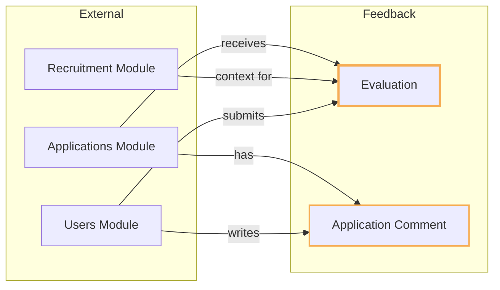
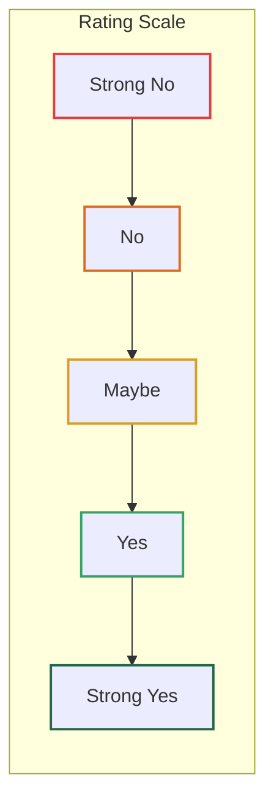
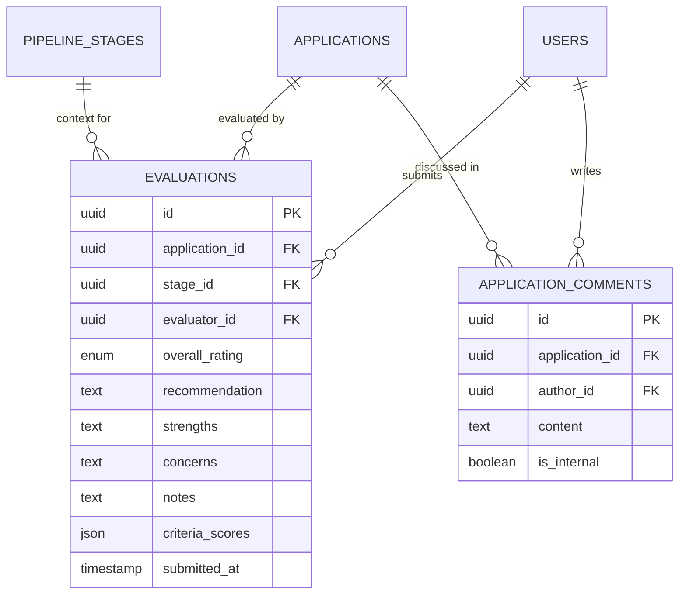
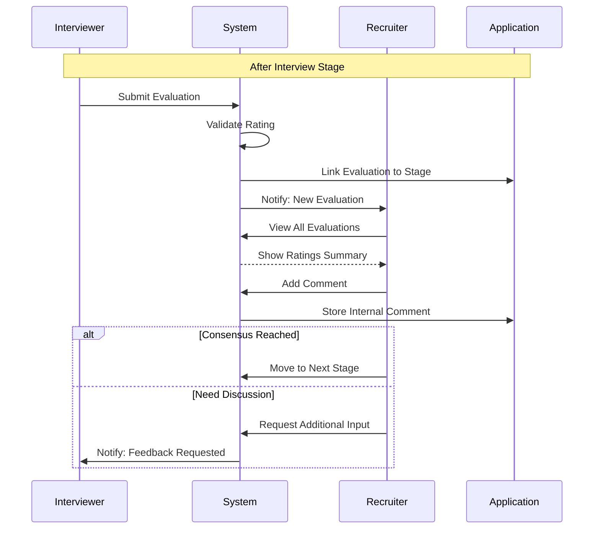

# Feedback Module

## Overview

The **Feedback** module manages evaluations and comments on job applications within the recruitment system. It enables interviewers and team members to provide structured feedback, ratings, and collaborate on hiring decisions.

## Context

This module captures the qualitative assessment of candidates throughout the hiring pipeline. Evaluations are tied to specific pipeline stages, allowing for stage-specific feedback (e.g., phone screen vs. technical interview), while comments provide a collaborative discussion thread on applications.

### Domain Position



## Models

### Evaluation

Structured feedback submitted by an evaluator for a specific application at a specific pipeline stage.

| Property          | Type                 | Description                       |
| ----------------- | -------------------- | --------------------------------- |
| `id`              | UUID                 | Primary key                       |
| `application_id`  | UUID                 | FK to application being evaluated |
| `stage_id`        | UUID                 | FK to pipeline stage              |
| `evaluator_id`    | UUID                 | FK to user who submitted          |
| `overall_rating`  | EvaluationRatingEnum | Overall candidate rating          |
| `recommendation`  | text (nullable)      | Hire/no-hire recommendation       |
| `strengths`       | text (nullable)      | Candidate strengths               |
| `concerns`        | text (nullable)      | Areas of concern                  |
| `notes`           | text (nullable)      | Additional notes                  |
| `criteria_scores` | array<string, mixed> | Structured scoring (JSON)         |
| `submitted_at`    | timestamp (nullable) | When evaluation was finalized     |

**Relationships:**

- `belongsTo` Application
- `belongsTo` Stage
- `belongsTo` User (evaluator)

### ApplicationComment

Discussion comments on an application, visible to team members.

| Property         | Type    | Description                           |
| ---------------- | ------- | ------------------------------------- |
| `id`             | UUID    | Primary key                           |
| `application_id` | UUID    | FK to application                     |
| `author_id`      | UUID    | FK to user who wrote comment          |
| `content`        | text    | Comment text                          |
| `is_internal`    | boolean | Hidden from candidate (default: true) |

**Relationships:**

- `belongsTo` Application
- `belongsTo` User (author)

## Enums

### EvaluationRatingEnum

A 5-point scale for rating candidates:

```
StrongNo  → Definite rejection (🔴 Red)
No        → Leaning reject (🟠 Orange)
Maybe     → Undecided (🟡 Yellow)
Yes       → Leaning hire (🟢 Emerald)
StrongYes → Definite hire (🟢 Green)
```

Each rating has:

- **Color**: Visual indicator for UI
- **Label**: Human-readable label

## Rating Distribution Visualization



## Entity Relationship Diagram



## Business Rules

### Evaluations

1. **Stage-Specific**: Each evaluation is tied to a specific pipeline stage
2. **One Per Evaluator Per Stage**: An evaluator submits one evaluation per application per stage
3. **Required Rating**: `overall_rating` is mandatory
4. **Criteria Scores**: Optional structured scoring stored as JSON for flexibility
5. **Submission Tracking**: `submitted_at` marks when evaluation was finalized

### Structured Criteria Scores

The `criteria_scores` JSON field allows flexible evaluation criteria:

```json
{
    "technical_skills": 4,
    "communication": 5,
    "problem_solving": 3,
    "culture_fit": 4
}
```

### Comments

1. **Internal by Default**: Comments are internal (hidden from candidates) by default
2. **Collaboration**: Multiple team members can comment on the same application
3. **Audit Trail**: Comments preserve discussion history

### Authorization

Policies control access for:

- `EvaluationPolicy`: Who can view/submit evaluations
- `ApplicationCommentPolicy`: Who can view/create comments

## Workflow Integration



## Directory Structure

```
feedback/
├── database/
│   ├── factories/
│   │   ├── ApplicationCommentFactory.php
│   │   └── EvaluationFactory.php
│   └── migrations/
│       ├── 2026_01_15_220001_create_evaluations_table.php
│       └── 2026_01_15_220002_create_application_comments_table.php
├── src/
│   ├── Enums/
│   │   └── EvaluationRatingEnum.php
│   ├── Models/
│   │   ├── ApplicationComment.php
│   │   └── Evaluation.php
│   ├── Policies/
│   │   ├── ApplicationCommentPolicy.php
│   │   └── EvaluationPolicy.php
│   └── FeedbackServiceProvider.php
└── tests/
    └── Feature/
        ├── ApplicationCommentTest.php
        └── EvaluationTest.php
```

## TODO / Future Enhancements

- [ ] Evaluation templates per stage type
- [ ] Rating aggregation and consensus calculation
- [ ] Comment mentions (@user) with notifications
- [ ] Evaluation reminders for pending reviews
- [ ] Anonymous evaluation mode
- [ ] Scorecard builder for custom criteria
- [ ] Evaluation comparison across candidates
- [ ] Export evaluations to PDF
