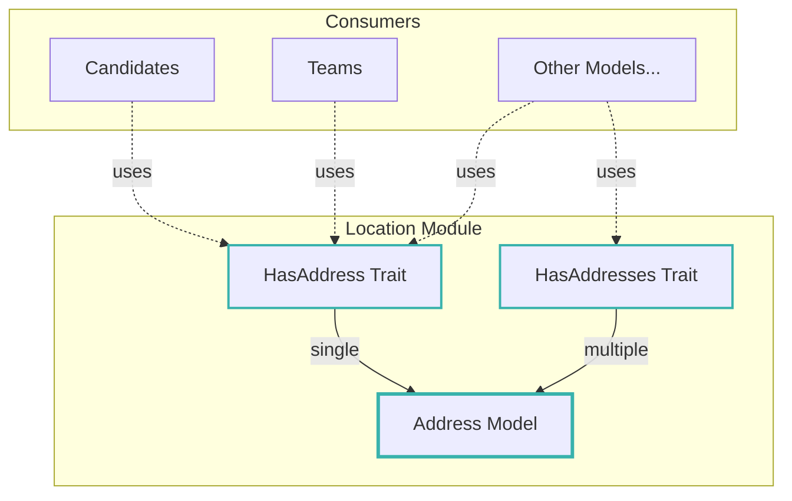
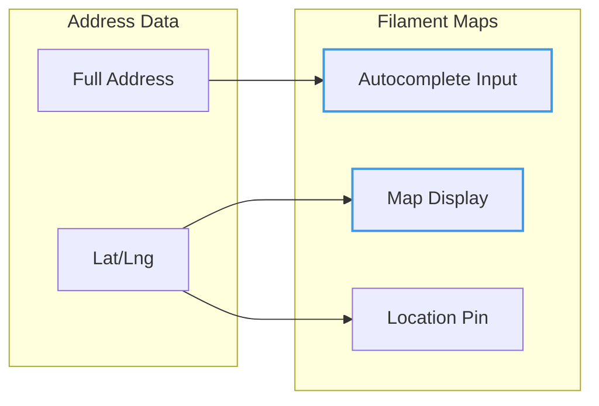
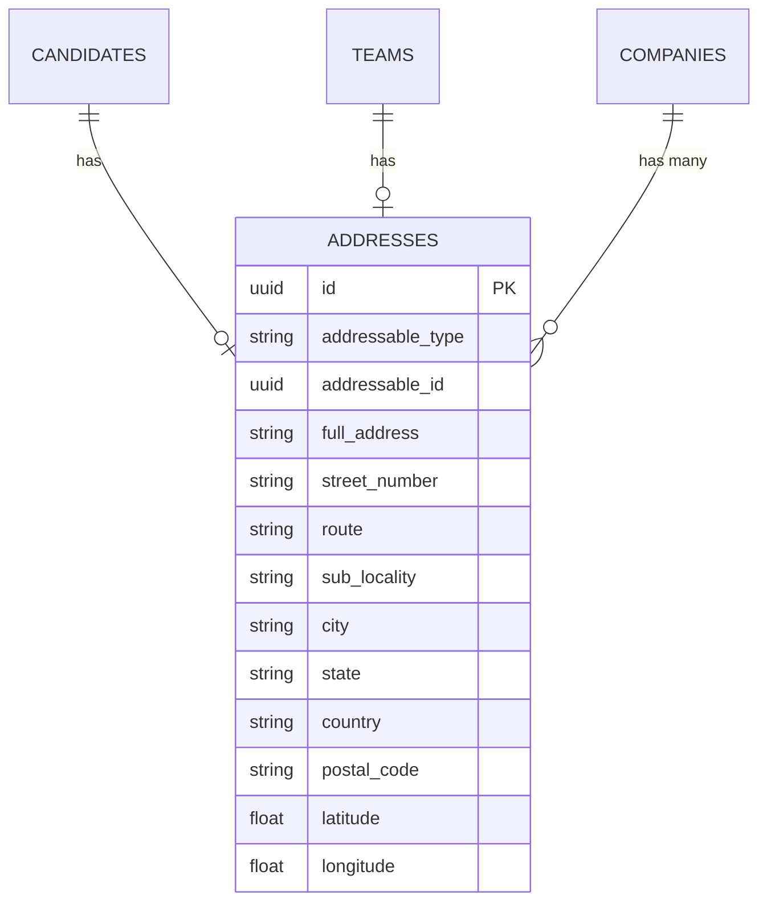

# Location Module

## Overview

The **Location** module provides reusable address management functionality for the recruitment system. It offers a
polymorphic address model that can be attached to any entity in the system, along with convenient traits for easy
integration.

## Context

This module serves as a shared infrastructure component, enabling any model to have associated address information. It's
designed to work seamlessly with Filament Google Maps for address autocomplete and map visualization.

### Domain Position



## Models

### Address

A polymorphic model that stores complete address information with geolocation support.

| Property           | Type   | Description                |
| ------------------ | ------ | -------------------------- |
| `id`               | UUID   | Primary key                |
| `addressable_type` | string | Polymorphic type           |
| `addressable_id`   | UUID   | Polymorphic ID             |
| `full_address`     | string | Complete formatted address |
| `street_number`    | string | Street number              |
| `route`            | string | Street name                |
| `sub_locality`     | string | Neighborhood/district      |
| `city`             | string | City name                  |
| `state`            | string | State/province             |
| `country`          | string | Country name               |
| `postal_code`      | string | ZIP/postal code            |
| `latitude`         | float  | GPS latitude               |
| `longitude`        | float  | GPS longitude              |

**Computed Attributes:**

- `location`: Returns `{lat, lng}` array for map integration
- `label`: Formatted label (e.g., "City, State")

**Relationships:**

- `morphTo` addressable (polymorphic parent)

## Traits

### HasAddress

Use when a model needs **one** address (most common case).

```php
use He4rt\Location\Concerns\HasAddress;

class Candidate extends Model
{
    use HasAddress;
}

// Usage
$candidate->address; // Returns single Address or null
$candidate->address()->create([...]);
```

### HasAddresses

Use when a model needs **multiple** addresses.

```php
use He4rt\Location\Concerns\HasAddresses;

class Company extends Model
{
    use HasAddresses;
}

// Usage
$company->address; // Returns Collection of Address
$company->address()->create([...]); // Add new address
```

## Filament Google Maps Integration

The Address model is designed to work with the Filament Google Maps package:

```php
// Static methods for package configuration
Address::getLatLngAttributes(); // ['lat' => 'latitude', 'lng' => 'longitude']
Address::getComputedLocation(); // 'location'
```

### Map Display



## Entity Relationship Diagram



## Business Rules

### Address Structure

1. **Polymorphic Design**: Any model can have addresses via morphTo relationship
2. **Geocoding**: Latitude and longitude stored for map functionality
3. **Granular Fields**: Address broken into components for filtering/searching
4. **Full Address**: Complete formatted string for display

### Usage Patterns

1. **Single Address**: Use `HasAddress` trait for entities with one location
2. **Multiple Addresses**: Use `HasAddresses` trait for entities with multiple locations
3. **Geolocation**: Always store lat/lng for map features

### Authorization

The `AddressPolicy` controls:

- `viewAny`: List addresses
- `view`: View specific address
- `create`: Add new address
- `update`: Modify address
- `delete`: Remove address

## Directory Structure

```
location/
├── database/
│   ├── factories/
│   │   └── AddressFactory.php
│   └── migrations/
│       └── 2025_02_26_161734_create_addresses_table.php
├── src/
│   ├── Concerns/
│   │   ├── HasAddress.php
│   │   └── HasAddresses.php
│   ├── Address.php
│   ├── AddressPolicy.php
│   └── LocationServiceProvider.php
└── tests/
    └── Feature/
```

## Usage Examples

### Adding Address to a Model

```php
// In your model
use He4rt\Location\Concerns\HasAddress;

class Candidate extends Model
{
    use HasAddress;
}
```

### Creating an Address

```php
$candidate->address()->create([
    'full_address' => '123 Main St, São Paulo, SP 01310-100, Brazil',
    'street_number' => '123',
    'route' => 'Main St',
    'city' => 'São Paulo',
    'state' => 'SP',
    'country' => 'Brazil',
    'postal_code' => '01310-100',
    'latitude' => -23.5505,
    'longitude' => -46.6333,
]);
```

### Querying by Location

```php
// Find candidates in a specific city
Candidate::whereHas('address', function ($query) {
    $query->where('city', 'São Paulo');
})->get();
```

## TODO / Future Enhancements

- [ ] Address validation service
- [ ] Geocoding API integration for auto-fill
- [ ] Distance calculation between addresses
- [ ] Address formatting by country
- [ ] Region/timezone detection
- [ ] Address history tracking
- [ ] Bulk address import
