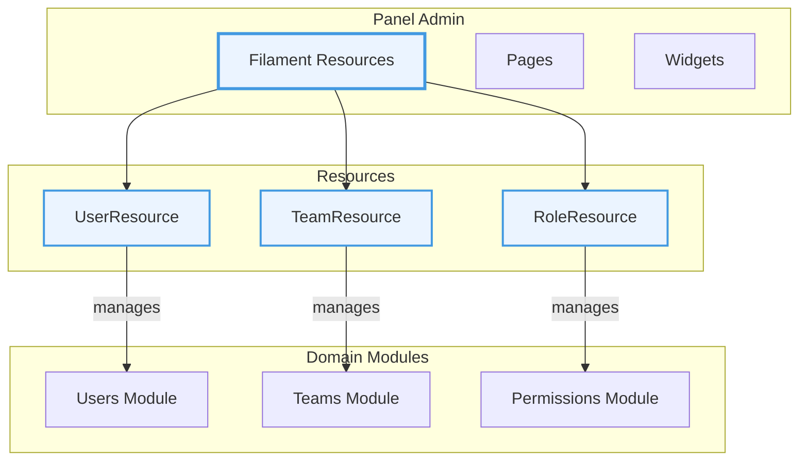
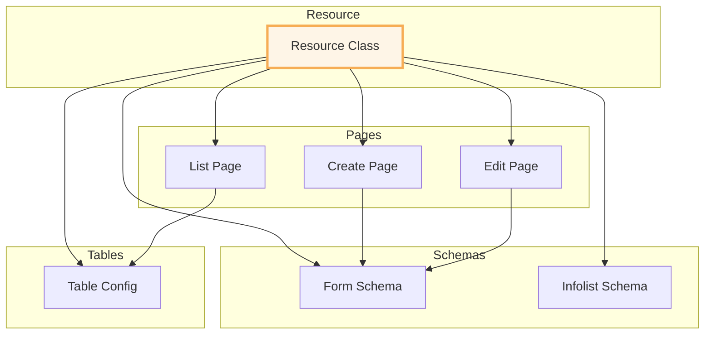

# Panel Admin Module

## Overview

The **Panel Admin** module provides the administrative interface for the recruitment system using Filament v4. It contains all Filament resources, pages, and widgets for managing users, teams, roles, and permissions through a modern admin panel.

## Context

This module serves as the presentation layer for system administration. It leverages Filament's powerful admin panel features to provide CRUD interfaces, forms, tables, and data visualization for core system entities.

### Domain Position



## Architecture

### Service Provider

The `PanelAdminServiceProvider` configures Filament's auto-discovery for the Admin panel:

```php
Panel::configureUsing(
    fn (Panel $panel) => match ($panel->currentPanel()) {
        FilamentPanel::Admin => $panel
            ->discoverResources(...)
            ->discoverPages(...)
            ->discoverWidgets(...)
            ->discoverClusters(...),
        default => null,
    }
);
```

### Resource Structure

Each resource follows a consistent organizational pattern:

```
Resources/
└── {Entity}/
    ├── {Entity}Resource.php      # Main resource class
    ├── Pages/
    │   ├── Create{Entity}.php    # Create page
    │   ├── Edit{Entity}.php      # Edit page
    │   └── List{Entity}s.php     # List/index page
    ├── Schemas/
    │   ├── {Entity}Form.php      # Form schema
    │   └── {Entity}Infolist.php  # View schema (optional)
    └── Tables/
        └── {Entity}sTable.php    # Table configuration
```

## Resources

### UserResource

Manages system users through the admin panel.

| Feature      | Description        |
| ------------ | ------------------ |
| Model        | `He4rt\Users\User` |
| Slug         | `/users`           |
| Record Title | `name`             |
| Icon         | Rectangle Stack    |

**Pages:**

- `ListUsers` - Paginated user list with search/filters
- `CreateUser` - User creation form
- `EditUser` - User editing form

**Components:**

- `UserForm` - Form schema for create/edit
- `UserInfolist` - View schema for user details
- `UsersTable` - Table configuration with columns/actions

### TeamResource

Manages teams/organizations in the system.

| Feature | Description        |
| ------- | ------------------ |
| Model   | `He4rt\Teams\Team` |
| Slug    | `/teams`           |

**Pages:**

- `ListTeams` - Team listing
- `CreateTeam` - Team creation
- `EditTeam` - Team editing

**Relation Managers:**

- `MembersRelationManager` - Manage team members

**Components:**

- `TeamForm` - Form schema
- `TeamsTable` - Table configuration

### RoleResource

Manages roles and permissions assignment.

| Feature | Description              |
| ------- | ------------------------ |
| Model   | `He4rt\Permissions\Role` |
| Slug    | `/roles`                 |

**Pages:**

- `ListRoles` - Role listing
- `CreateRole` - Role creation
- `EditRole` - Role editing

**Components:**

- `RoleForm` - Form schema
- `RoleInfolist` - View schema
- `RolesTable` - Table configuration
- `PermissionsCheckboxList` - Custom component for permission assignment

## Component Architecture



## Custom Components

### PermissionsCheckboxList

A custom Filament component for managing role permissions with a checkbox interface.

Location: `src/Filament/Resources/Permissions/Schemas/PermissionsCheckboxList.php`

Blade View: `resources/views/components/permissions-checkbox-list.blade.php`

## Business Rules

### Resource Access

1. **Panel Scoping**: Resources only load for the Admin panel
2. **Policy Integration**: Resources respect model policies for authorization
3. **Navigation Icons**: Each resource has a distinct Heroicon

### Form Organization

1. **Separated Concerns**: Forms, tables, and infolists in dedicated classes
2. **Reusability**: Schemas can be reused across pages
3. **Consistency**: All resources follow the same structural pattern

### Team Management

1. **Relation Managers**: Team members managed via relation manager
2. **Nested CRUD**: Members can be added/removed from team edit page

## Directory Structure

```
panel-admin/
├── resources/
│   └── views/
│       └── components/
│           └── permissions-checkbox-list.blade.php
├── src/
│   ├── Filament/
│   │   ├── Resources/
│   │   │   ├── Permissions/
│   │   │   │   ├── Pages/
│   │   │   │   │   ├── CreateRole.php
│   │   │   │   │   ├── EditRole.php
│   │   │   │   │   └── ListRoles.php
│   │   │   │   ├── Schemas/
│   │   │   │   │   ├── PermissionsCheckboxList.php
│   │   │   │   │   ├── RoleForm.php
│   │   │   │   │   └── RoleInfolist.php
│   │   │   │   ├── Tables/
│   │   │   │   │   └── RolesTable.php
│   │   │   │   └── RoleResource.php
│   │   │   ├── Teams/
│   │   │   │   ├── Pages/
│   │   │   │   │   ├── CreateTeam.php
│   │   │   │   │   ├── EditTeam.php
│   │   │   │   │   └── ListTeams.php
│   │   │   │   ├── RelationManagers/
│   │   │   │   │   └── MembersRelationManager.php
│   │   │   │   ├── Schemas/
│   │   │   │   │   └── TeamForm.php
│   │   │   │   ├── Tables/
│   │   │   │   │   └── TeamsTable.php
│   │   │   │   └── TeamResource.php
│   │   │   └── Users/
│   │   │       ├── Pages/
│   │   │       │   ├── CreateUser.php
│   │   │       │   ├── EditUser.php
│   │   │       │   └── ListUsers.php
│   │   │       ├── Schemas/
│   │   │       │   ├── UserForm.php
│   │   │       │   └── UserInfolist.php
│   │   │       ├── Tables/
│   │   │       │   └── UsersTable.php
│   │   │       └── UserResource.php
│   │   ├── Pages/
│   │   ├── Widgets/
│   │   └── Clusters/
│   └── PanelAdminServiceProvider.php
└── tests/
    └── Feature/
        └── Filament/
            ├── RoleResourceTest.php
            ├── TeamResourceTest.php
            └── UserResourceTest.php
```

## Testing

Each resource has corresponding feature tests:

```php
// Example test structure
it('can render the users list page', function () {
    $this->get(UserResource::getUrl('index'))
        ->assertSuccessful();
});

it('can create a user', function () {
    // Test user creation through Filament
});
```

## TODO / Future Enhancements

- [ ] Dashboard widgets for key metrics
- [ ] Bulk actions for users/teams
- [ ] Activity log viewer
- [ ] User impersonation feature
- [ ] Export functionality (CSV/Excel)
- [ ] Advanced filtering and saved filters
- [ ] Custom pages for reports
- [ ] Notification center integration
