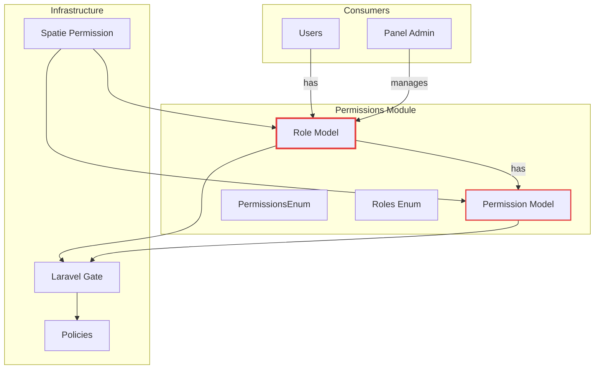
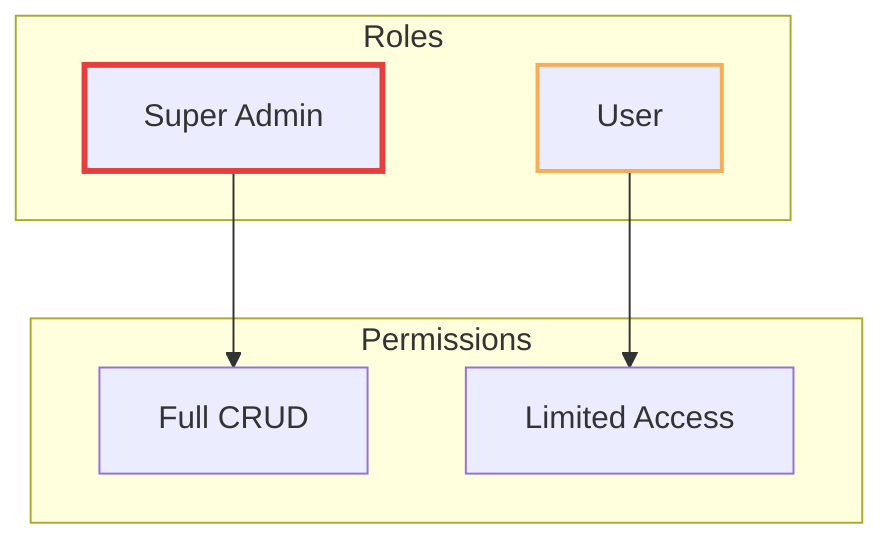
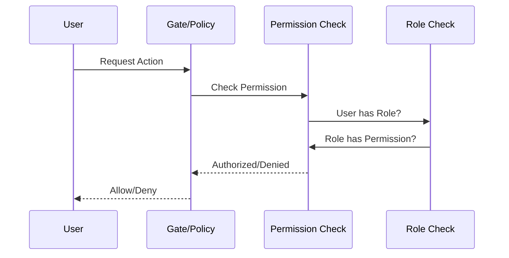

# Permissions Module

## Overview

The **Permissions** module provides role-based access control (RBAC) for the recruitment system. Built on top of Spatie's Laravel Permission package, it offers a structured approach to managing roles, permissions, and authorization across the application.

## Context

This module is the foundation for all authorization in the system. It defines roles (like SuperAdmin, User) and permissions (like view, create, update) that can be assigned to users. The permission system integrates with Laravel's Gate and policies for seamless authorization checks.

### Domain Position



## Models

### Role

Extends Spatie's Role model with application-specific features.

| Property     | Type   | Description               |
| ------------ | ------ | ------------------------- |
| `id`         | UUID   | Primary key               |
| `name`       | string | Role identifier           |
| `guard_name` | string | Auth guard (default: web) |

**Relationships:**

- `belongsToMany` Permission
- `belongsToMany` User

### Permission

Extends Spatie's Permission model.

| Property     | Type   | Description           |
| ------------ | ------ | --------------------- |
| `id`         | UUID   | Primary key           |
| `name`       | string | Permission identifier |
| `guard_name` | string | Auth guard            |

**Relationships:**

- `belongsToMany` Role

## Enums

### Roles

Predefined system roles:

```php
enum Roles: string
{
    case SuperAdmin = 'super_admin';
    case User = 'user';
}
```

### PermissionsEnum

Standard CRUD permission actions:

```php
enum PermissionsEnum: string
{
    case View = 'view';
    case ViewAny = 'view_any';
    case Create = 'create';
    case Update = 'update';
    case Delete = 'delete';
    case Restore = 'restore';
    case ForceDelete = 'force_delete';
}
```

**Helper Method:**

```php
// Generate permission name for a model
PermissionsEnum::View->buildPermissionFor(User::class);
// Returns: "view_users"
```

## Permission Naming Convention

Permissions follow the pattern: `{action}_{model_snake_case}`

| Model | View         | Create         | Update         | Delete         |
| ----- | ------------ | -------------- | -------------- | -------------- |
| User  | `view_users` | `create_users` | `update_users` | `delete_users` |
| Role  | `view_roles` | `create_roles` | `update_roles` | `delete_roles` |
| Team  | `view_teams` | `create_teams` | `update_teams` | `delete_teams` |

## RBAC Configuration

The `config/rbac.php` file defines role-permission mappings:

```php
return [
    'permissions' => [
        Roles::SuperAdmin->value => [
            Role::class => [
                PermissionsEnum::ViewAny,
                PermissionsEnum::View,
                PermissionsEnum::Create,
                PermissionsEnum::Update,
                PermissionsEnum::Delete,
                PermissionsEnum::ForceDelete,
                PermissionsEnum::Restore,
            ],
            // ... other models
        ],
    ],
];
```

## Role Hierarchy



## Commands

### SyncPermissionsCommand

Synchronizes permissions from configuration to database:

```bash
php artisan permissions:sync
```

This command:

1. Reads the `rbac.php` configuration
2. Creates missing permissions in the database
3. Assigns permissions to roles as defined
4. Removes orphaned permissions (optional)

## Business Rules

### Role Management

1. **Predefined Roles**: System comes with predefined roles (SuperAdmin, User)
2. **Custom Roles**: Additional roles can be created via admin panel
3. **Role Assignment**: Users can have multiple roles

### Permission Assignment

1. **Model-Based**: Permissions are tied to specific models
2. **Action-Based**: Standard CRUD actions defined in PermissionsEnum
3. **Configurable**: RBAC config defines which roles get which permissions

### Authorization Flow



### Super Admin

1. **Full Access**: SuperAdmin role has all permissions
2. **System Role**: Cannot be deleted
3. **Bootstrap**: First user typically gets SuperAdmin role

## Integration with Policies

Policies use permissions for authorization:

```php
class UserPolicy
{
    public function viewAny(User $user): bool
    {
        return $user->can('view_any_users');
    }

    public function create(User $user): bool
    {
        return $user->can('create_users');
    }
}
```

## Directory Structure

```
permissions/
├── config/
│   ├── permissions.php          # Spatie package config
│   └── rbac.php                 # Role-permission mappings
├── database/
│   ├── factories/
│   │   ├── PermissionFactory.php
│   │   └── RoleFactory.php
│   └── migrations/
│       └── 2025_12_23_193919_create_permission_tables.php
├── src/
│   ├── Commands/
│   │   └── SyncPermissions/
│   │       ├── ModelPayload.php
│   │       ├── RolePermissions.php
│   │       └── SyncPermissionsCommand.php
│   ├── Permission.php
│   ├── PermissionsEnum.php
│   ├── PermissionsServiceProvider.php
│   ├── Role.php
│   ├── RolePolicy.php
│   └── Roles.php
└── tests/
    ├── Feature/
    │   ├── Commands/
    │   │   └── SyncPermissionsCommandTest.php
    │   └── RolePolicyTest.php
    └── Unit/
        └── ModelsTest.php
```

## Usage Examples

### Checking Permissions

```php
// In controller
if ($user->can('create_applications')) {
    // Allow creation
}

// In Blade
@can('update_users')
    <button>Edit User</button>
@endcan
```

### Assigning Roles

```php
$user->assignRole(Roles::SuperAdmin->value);
$user->assignRole('recruiter');
```

### Creating Custom Permissions

```php
// Add to rbac.php
Roles::Recruiter->value => [
    Application::class => [
        PermissionsEnum::ViewAny,
        PermissionsEnum::View,
        PermissionsEnum::Update,
    ],
],
```

## TODO / Future Enhancements

- [ ] Permission groups for easier management
- [ ] Role inheritance (child roles inherit parent permissions)
- [ ] Temporary permissions with expiration
- [ ] Permission wildcards (e.g., `applications.*`)
- [ ] Audit log for permission changes
- [ ] Team-scoped permissions
- [ ] Permission caching optimization
- [ ] UI for permission matrix visualization
