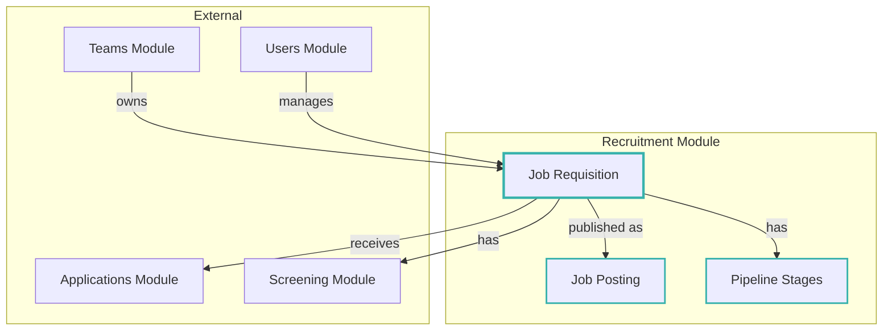
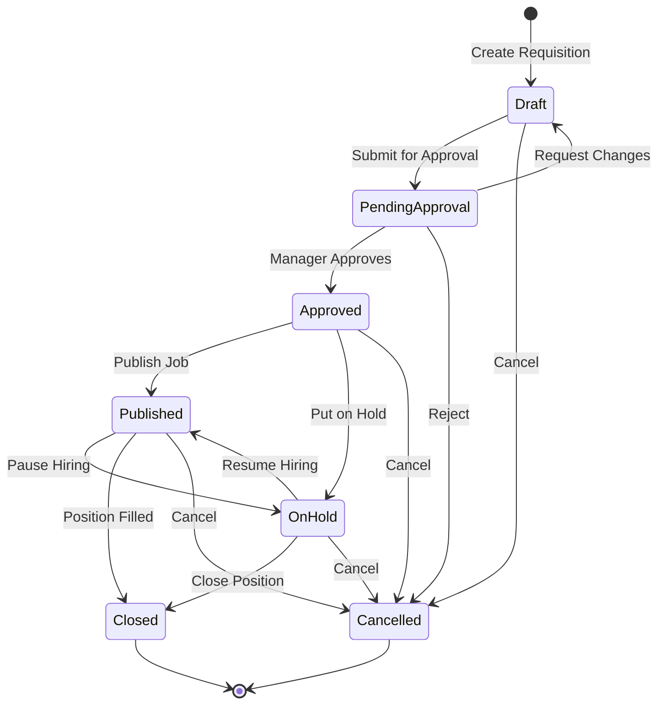
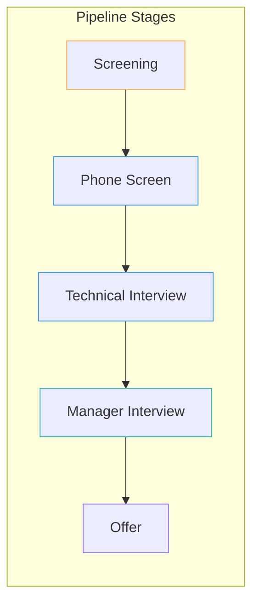
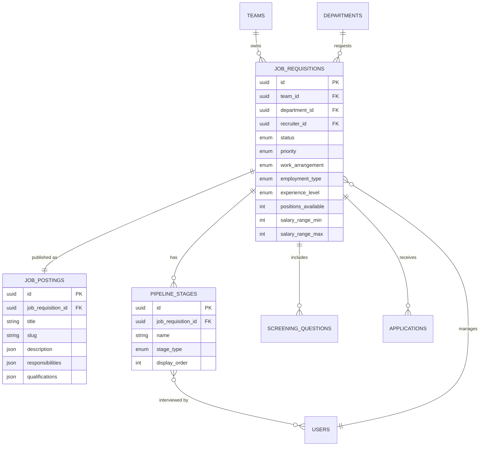

# Recruitment Module

## Overview

The **Recruitment** module is the core of the hiring system, managing job requisitions, job postings, and pipeline stages. It handles the complete lifecycle of a position from internal approval through public posting to candidate evaluation stages.

## Context

This module represents the employer's side of the recruitment process. It manages what positions are being hired for, how they're presented to candidates, and what stages candidates must go through during the hiring process.

### Domain Position



## Models

### JobRequisition

The internal job request representing a position to be filled.

| Property              | Type                    | Description             |
| --------------------- | ----------------------- | ----------------------- |
| `id`                  | UUID                    | Primary key             |
| `team_id`             | UUID                    | FK to team/organization |
| `department_id`       | UUID                    | FK to department        |
| `hiring_manager_id`   | UUID                    | FK to hiring manager    |
| `created_by_id`       | UUID                    | FK to creator           |
| `status`              | RequisitionStatusEnum   | Current status          |
| `priority`            | RequisitionPriorityEnum | Hiring priority         |
| `work_arrangement`    | WorkArrangementEnum     | Remote/Hybrid/OnSite    |
| `employment_type`     | EmploymentTypeEnum      | Full-time/Contract/etc  |
| `experience_level`    | ExperienceLevelEnum     | Required experience     |
| `positions_available` | integer                 | Number of openings      |
| `salary_range_min`    | integer (nullable)      | Minimum salary          |
| `salary_range_max`    | integer (nullable)      | Maximum salary          |
| `salary_currency`     | string                  | Currency code           |
| `target_start_at`     | timestamp (nullable)    | Target start date       |
| `approved_at`         | timestamp (nullable)    | When approved           |
| `published_at`        | timestamp (nullable)    | When published          |
| `closed_at`           | timestamp (nullable)    | When closed             |
| `is_internal_only`    | boolean                 | Internal posting only   |
| `is_confidential`     | boolean                 | Confidential search     |

**Relationships:**

- `belongsTo` Team
- `belongsTo` Department
- `belongsTo` User (hiringManager, createdBy)
- `hasOne` JobPosting
- `hasMany` Stage (pipeline stages)
- `hasMany` ScreeningQuestion
- `hasMany` Application

### JobPosting

The public-facing job advertisement.

| Property                       | Type         | Description                  |
| ------------------------------ | ------------ | ---------------------------- |
| `id`                           | UUID         | Primary key                  |
| `job_requisition_id`           | UUID         | FK to requisition            |
| `title`                        | string       | Job title                    |
| `slug`                         | string       | URL-friendly slug            |
| `summary`                      | text         | Brief summary                |
| `description`                  | array<mixed> | Full description (JSON)      |
| `responsibilities`             | array<mixed> | Job duties (JSON)            |
| `required_qualifications`      | array<mixed> | Must-have skills (JSON)      |
| `preferred_qualifications`     | array<mixed> | Nice-to-have skills (JSON)   |
| `benefits`                     | array<mixed> | Compensation/benefits (JSON) |
| `about_company`                | text         | Company description          |
| `about_team`                   | text         | Team description             |
| `work_schedule`                | string       | Working hours                |
| `accessibility_accommodations` | text         | Accessibility info           |
| `is_disability_confident`      | boolean      | Disability friendly          |
| `external_post_url`            | string       | External job board URL       |

**Relationships:**

- `belongsTo` JobRequisition

### Stage

A step in the hiring pipeline.

| Property                 | Type          | Description               |
| ------------------------ | ------------- | ------------------------- |
| `id`                     | UUID          | Primary key               |
| `job_requisition_id`     | UUID          | FK to requisition         |
| `name`                   | string        | Stage name                |
| `stage_type`             | StageTypeEnum | Type of stage             |
| `display_order`          | integer       | Order in pipeline         |
| `description`            | text          | Stage description         |
| `expected_duration_days` | integer       | Expected days to complete |
| `active`                 | boolean       | Stage is active           |

**Relationships:**

- `belongsTo` JobRequisition
- `belongsToMany` User (interviewers)

### InterviewerPivot

Links interviewers to pipeline stages.

## Enums

### RequisitionStatusEnum

```
Draft           → Initial creation (✏️)
PendingApproval → Awaiting approval (⏰)
Approved        → Approved, not published (✅)
Published       → Live and accepting applications (🚩)
OnHold          → Temporarily paused (⏸️)
Closed          → Filled or completed (❌)
Cancelled       → Cancelled entirely (🚫)
```

### RequisitionPriorityEnum

```
Low      → Can wait
Normal   → Standard priority
High     → Urgent hire
Critical → Business-critical
```

### EmploymentTypeEnum

```
FullTimeEmployee → Permanent full-time (💼)
Contractor       → Contract/1099 (📄)
Intern           → Internship (🎓)
Temporary        → Temp position (📅)
PartTime         → Part-time (⏰)
```

### WorkArrangementEnum

```
Remote  → Fully remote (🖥️)
Hybrid  → Mix of remote/office (🌐)
OnSite  → Office-based (📍)
```

### ExperienceLevelEnum

```
Intern     → Student/Intern
EntryLevel → 0-2 years
MidLevel   → 2-5 years
Senior     → 5-8 years
Lead       → 8+ years, leadership
Principal  → Expert/Architect level
```

### StageTypeEnum

```
Screening  → Initial review (🟡)
Assessment → Skills assessment (🔵)
Interview  → Interview round (🟢)
Offer      → Offer stage (🟣)
Hired      → Successfully hired (✅)
Rejected   → Not selected (❌)
```

## Requisition Lifecycle



## Pipeline Configuration



## Entity Relationship Diagram



## Business Rules

### Requisition Management

1. **Approval Flow**: Requisitions must be approved before publishing
2. **Ownership**: Each requisition belongs to a team and department
3. **Hiring Manager**: A designated user responsible for the hire
4. **Confidential**: Some searches are hidden from general view

### Job Posting

1. **One-to-One**: Each requisition has at most one public posting
2. **Rich Content**: Job details stored as structured JSON for flexibility
3. **SEO Friendly**: Slugs generated for clean URLs
4. **Accessibility**: Supports disability-confident employers

### Pipeline Stages

1. **Ordered**: Stages have a defined order
2. **Typed**: Each stage has a type (Screening, Interview, etc.)
3. **Interviewers**: Multiple interviewers can be assigned per stage
4. **Flexible**: Each requisition can have a custom pipeline

## Directory Structure

```
recruitment/
├── database/
│   ├── factories/
│   │   ├── InterviewerPivotFactory.php
│   │   ├── JobPostingFactory.php
│   │   ├── JobRequisitionFactory.php
│   │   └── StageFactory.php
│   └── migrations/
│       ├── 2026_01_15_170005_create_recruitment_job_requisitions_table.php
│       ├── 2026_01_15_171951_create_recruitment_job_postings_table.php
│       ├── 2026_01_15_173821_create_recruitment_pipeline_stages_table.php
│       └── 2026_01_15_174426_create_recruitment_pipeline_stage_user.php
├── lang/
│   ├── en/
│   │   ├── filament.php
│   │   ├── requisitions.php
│   │   └── stage_type.php
│   └── pt_BR/
│       ├── filament.php
│       ├── requisitions.php
│       └── stage_type.php
├── src/
│   ├── Requisitions/
│   │   ├── Enums/
│   │   │   ├── EmploymentTypeEnum.php
│   │   │   ├── ExperienceLevelEnum.php
│   │   │   ├── RequisitionPriorityEnum.php
│   │   │   ├── RequisitionStatusEnum.php
│   │   │   └── WorkArrangementEnum.php
│   │   ├── Models/
│   │   │   ├── JobPosting.php
│   │   │   └── JobRequisition.php
│   │   └── Policies/
│   │       ├── JobPostingPolicy.php
│   │       └── JobRequisitionPolicy.php
│   ├── Stages/
│   │   ├── Concerns/
│   │   │   └── InteractsWithInterviewStages.php
│   │   ├── Enums/
│   │   │   └── StageTypeEnum.php
│   │   ├── Models/
│   │   │   ├── InterviewerPivot.php
│   │   │   └── Stage.php
│   │   └── Policies/
│   │       └── StagePolicy.php
│   └── RecruitmentServiceProvider.php
└── tests/
    └── Feature/
```

## TODO / Future Enhancements

- [ ] Requisition templates for common positions
- [ ] Requisition templates with AI
- [ ] Approval workflow with multiple approvers
- [ ] Job board integrations (LinkedIn, Indeed)
- [ ] Requisition cloning !!
- [ ] Budget tracking per requisition
- [ ] Time-to-fill analytics
- [ ] Automated stage advancement rules
- [ ] Interview scheduling integration (do not focus on that at v1)
- [ ] Offer letter generation
