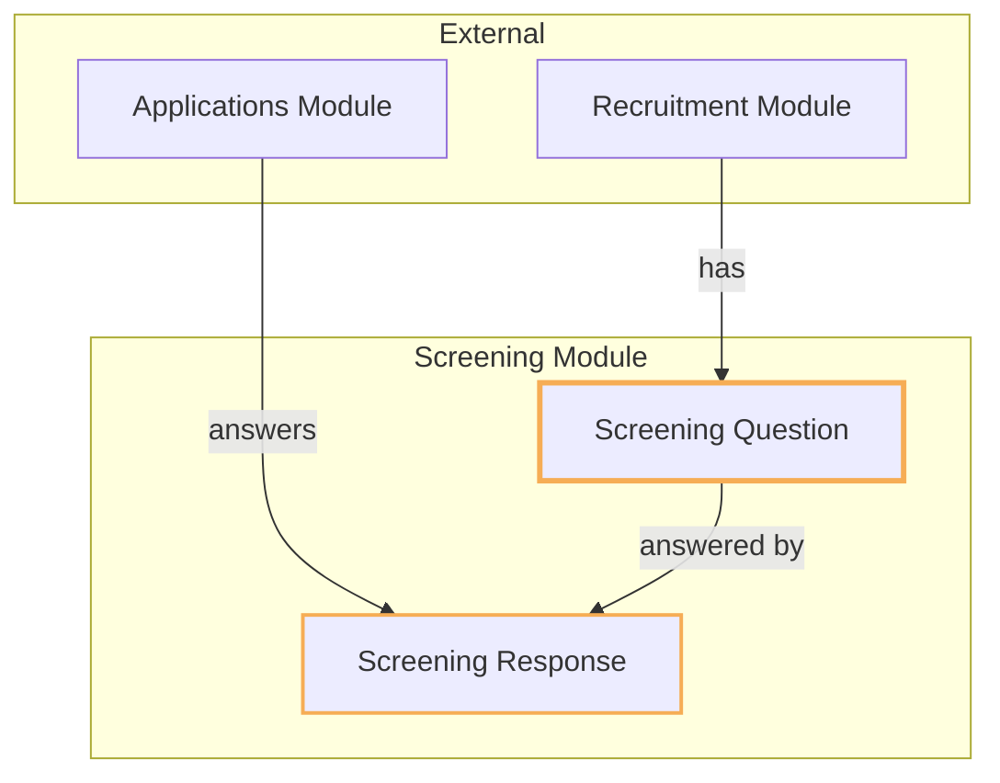
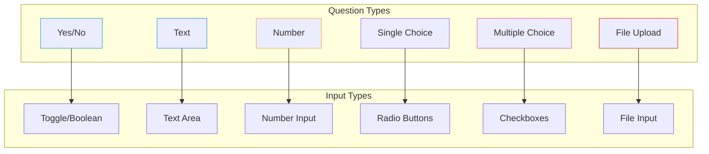
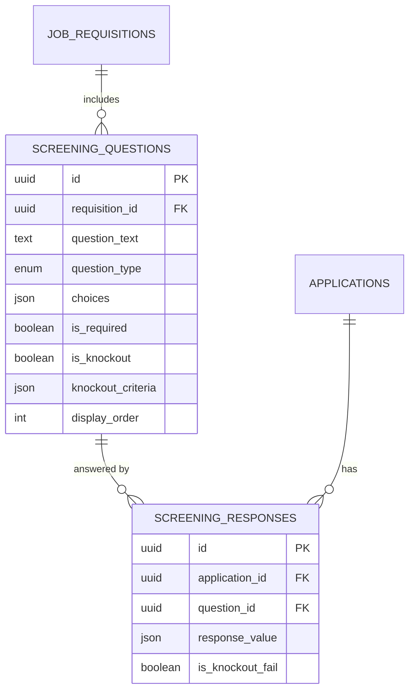
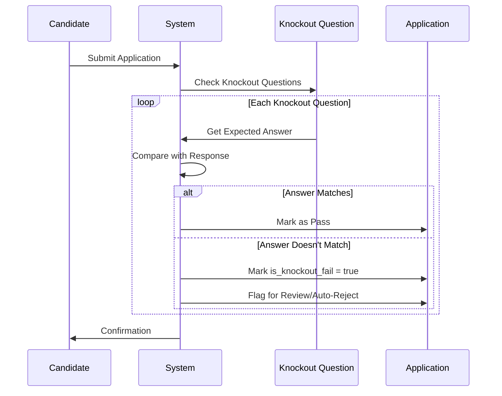

# Screening Module

## Overview

The **Screening** module manages pre-application screening questions and candidate responses. It enables recruiters to gather structured information from candidates during the application process and automatically filter candidates based on knockout criteria.

## Context

This module supports the initial candidate filtering process. Recruiters can define custom questions per job requisition, and candidates must answer these questions when applying. Knockout questions can automatically flag or reject candidates who don't meet minimum requirements.

### Domain Position



## Models

### ScreeningQuestion

A question that candidates must answer when applying.

| Property            | Type                            | Description                  |
| ------------------- | ------------------------------- | ---------------------------- |
| `id`                | UUID                            | Primary key                  |
| `requisition_id`    | UUID                            | FK to job requisition        |
| `question_text`     | text                            | The question to display      |
| `question_type`     | QuestionTypeEnum                | Type of question             |
| `choices`           | array<int, mixed> (nullable)    | Options for choice questions |
| `is_required`       | boolean                         | Must be answered             |
| `is_knockout`       | boolean                         | Auto-reject on wrong answer  |
| `knockout_criteria` | array<string, mixed> (nullable) | Expected answer for knockout |
| `display_order`     | integer                         | Order in form                |

**Relationships:**

- `belongsTo` JobRequisition
- `hasMany` ScreeningResponse

### ScreeningResponse

A candidate's answer to a screening question.

| Property           | Type                 | Description              |
| ------------------ | -------------------- | ------------------------ |
| `id`               | UUID                 | Primary key              |
| `application_id`   | UUID                 | FK to application        |
| `question_id`      | UUID                 | FK to screening question |
| `response_value`   | array<string, mixed> | The answer (JSON)        |
| `is_knockout_fail` | boolean              | Failed knockout criteria |

**Relationships:**

- `belongsTo` Application
- `belongsTo` ScreeningQuestion

## Enums

### QuestionTypeEnum

```
YesNo          → Simple yes/no toggle
Text           → Free-form text input
Number         → Numeric input
SingleChoice   → Radio buttons (one selection)
MultipleChoice → Checkboxes (multiple selections)
FileUpload     → Document upload
```

## Question Types Visualization



## Entity Relationship Diagram



## Knockout System

The knockout feature automatically identifies candidates who don't meet minimum requirements.



### Knockout Criteria Examples

```json
// Yes/No Question: "Are you authorized to work in the US?"
{
    "expected": "yes"
}

// Number Question: "Years of experience with PHP?"
{
    "minimum": 3
}

// Single Choice: "Highest education level?"
{
    "accepted": ["bachelors", "masters", "phd"]
}
```

## Business Rules

### Question Management

1. **Requisition-Scoped**: Questions belong to specific job requisitions
2. **Ordered Display**: Questions shown in `display_order` sequence
3. **Unique Order**: Each question must have a unique order within its requisition
4. **Required Questions**: Can mark questions as mandatory

### Choice Questions

1. **Choices Array**: Single/Multiple choice questions store options in JSON
2. **Value/Label Pairs**: Each choice has a value and display label
3. **Flexible Structure**: Supports various choice formats

Example choices structure:

```json
[
    { "value": "yes", "label": "Yes" },
    { "value": "no", "label": "No" },
    { "value": "unsure", "label": "Not Sure" }
]
```

### Knockout Logic

1. **Optional Feature**: Not all questions need to be knockout
2. **Criteria Defined**: Knockout questions specify expected answers
3. **Automatic Flagging**: System marks responses that fail criteria
4. **Review Option**: Admins can override knockout decisions

### Responses

1. **One Per Question**: Each application has one response per question
2. **JSON Storage**: Flexible response format stored as JSON
3. **Unique Constraint**: `unique(application_id, question_id)`

## Directory Structure

```
screening/
├── database/
│   ├── factories/
│   │   ├── ScreeningQuestionFactory.php
│   │   └── ScreeningResponseFactory.php
│   └── migrations/
│       ├── 2026_01_15_210001_create_screening_questions_table.php
│       └── 2026_01_15_210002_create_screening_responses_table.php
├── src/
│   ├── Enums/
│   │   └── QuestionTypeEnum.php
│   ├── Models/
│   │   ├── ScreeningQuestion.php
│   │   └── ScreeningResponse.php
│   └── ScreeningServiceProvider.php
└── tests/
    └── Feature/
        ├── ScreeningQuestionTest.php
        └── ScreeningResponseTest.php
```

## Usage Examples

### Creating Questions

```php
// Yes/No knockout question
ScreeningQuestion::create([
    'requisition_id' => $requisition->id,
    'question_text' => 'Are you authorized to work in the United States?',
    'question_type' => QuestionTypeEnum::YesNo,
    'is_required' => true,
    'is_knockout' => true,
    'knockout_criteria' => ['expected' => 'yes'],
    'display_order' => 1,
]);

// Multiple choice question
ScreeningQuestion::create([
    'requisition_id' => $requisition->id,
    'question_text' => 'Which programming languages are you proficient in?',
    'question_type' => QuestionTypeEnum::MultipleChoice,
    'choices' => [
        ['value' => 'php', 'label' => 'PHP'],
        ['value' => 'python', 'label' => 'Python'],
        ['value' => 'javascript', 'label' => 'JavaScript'],
        ['value' => 'go', 'label' => 'Go'],
    ],
    'is_required' => true,
    'display_order' => 2,
]);
```

### Storing Responses

```php
ScreeningResponse::create([
    'application_id' => $application->id,
    'question_id' => $question->id,
    'response_value' => ['answer' => 'yes'],
    'is_knockout_fail' => false,
]);
```

### Checking Knockout Status

```php
$application->screeningResponses()
    ->where('is_knockout_fail', true)
    ->exists();
```

## TODO / Future Enhancements

- [ ] Question templates library
- [ ] Conditional questions (show based on previous answers)
- [ ] Question branching logic
- [ ] Scoring/weighting for responses
- [ ] Bulk question import
- [ ] Question analytics (response distribution)
- [ ] AI-assisted knockout review
- [ ] Multi-language question support
