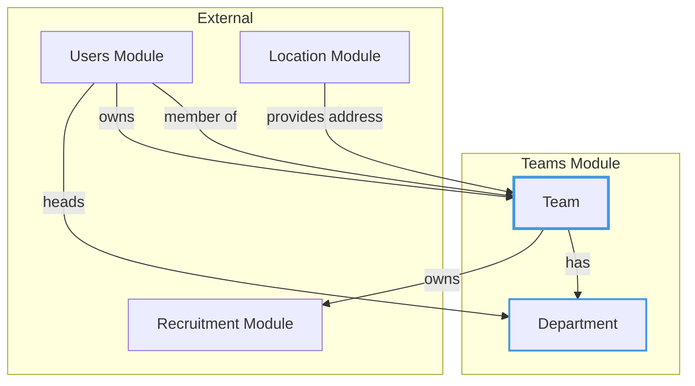
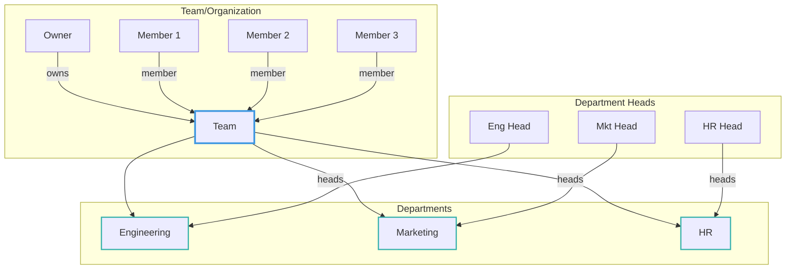
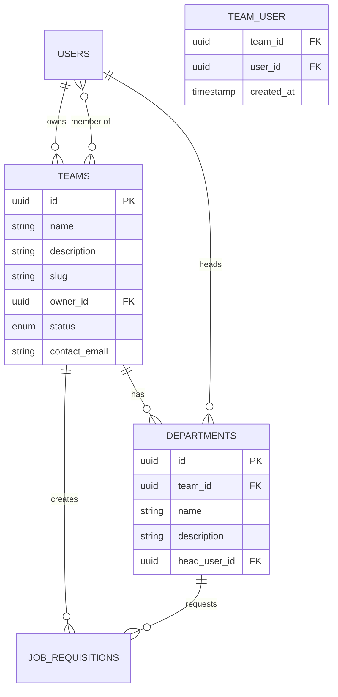
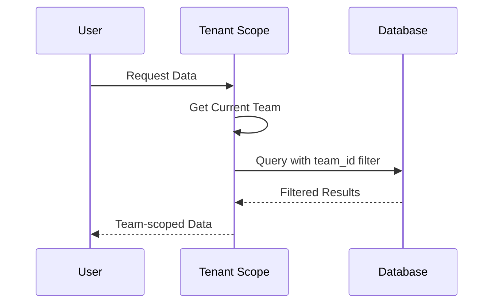
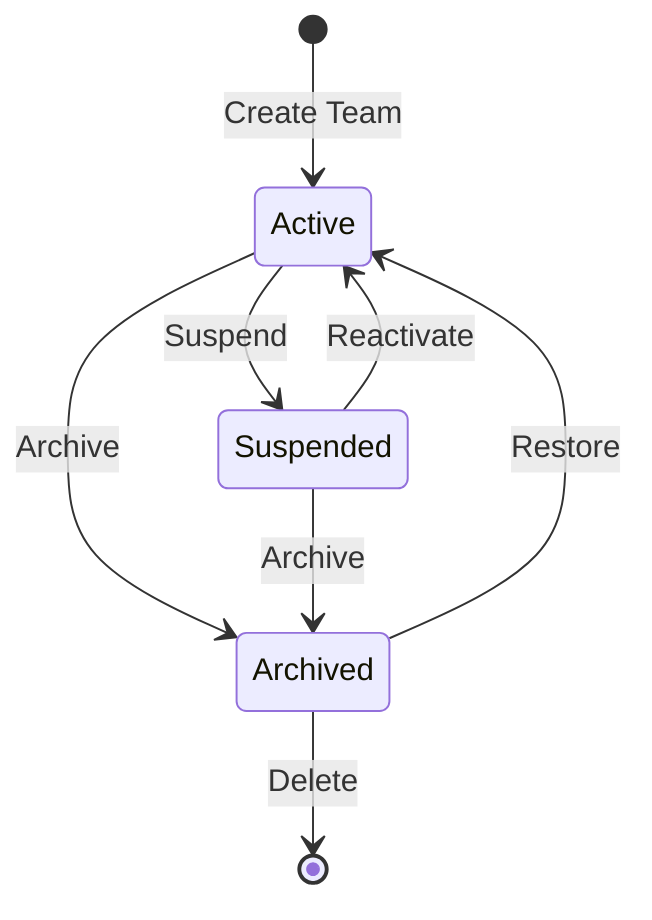

# Teams Module

## Overview

The **Teams** module manages organizational structure within the recruitment system. It handles teams (organizations/companies) and their departments, providing multi-tenancy support for the application.

## Context

This module represents the organizational hierarchy. Teams are the top-level tenant entities that own job requisitions, employ users, and manage candidates. Departments further subdivide teams for organizational clarity.

### Domain Position



## Models

### Team

The top-level organizational entity (company/organization).

| Property        | Type                 | Description             |
| --------------- | -------------------- | ----------------------- |
| `id`            | UUID                 | Primary key             |
| `name`          | string               | Team/company name       |
| `description`   | text                 | Team description        |
| `slug`          | string               | URL-friendly identifier |
| `owner_id`      | UUID                 | FK to owner user        |
| `status`        | TeamStatus           | Current status          |
| `contact_email` | string               | Primary contact email   |
| `deleted_at`    | timestamp (nullable) | Soft delete             |

**Relationships:**

- `belongsTo` User (owner)
- `belongsToMany` User (members)
- `hasMany` Department
- `morphMany` Address (via HasAddresses trait)

### Department

A subdivision within a team.

| Property       | Type                 | Description            |
| -------------- | -------------------- | ---------------------- |
| `id`           | UUID                 | Primary key            |
| `team_id`      | UUID                 | FK to parent team      |
| `name`         | string               | Department name        |
| `description`  | text                 | Department description |
| `head_user_id` | UUID                 | FK to department head  |
| `deleted_at`   | timestamp (nullable) | Soft delete            |

**Relationships:**

- `belongsTo` Team
- `belongsTo` User (headUser)

## Enums

### TeamStatus

```
Active    → Fully operational (🟢 Green)
Suspended → Temporarily disabled (🟡 Yellow)
Archived  → No longer active (🔴 Red)
```

Each status has:

- **Color**: Visual indicator
- **Icon**: Heroicon representation
- **Label**: Translatable label

## Organizational Hierarchy



## Entity Relationship Diagram



## Multi-Tenancy Support

The teams module provides multi-tenancy through the `InteractsWithTenants` trait:

```php
use He4rt\Teams\Concerns\InteractsWithTenants;

class SomeModel extends Model
{
    use InteractsWithTenants;
}
```

### Tenant Scoping



## Business Rules

### Team Management

1. **Ownership**: Every team must have an owner (a user)
2. **Membership**: Users can belong to multiple teams
3. **Status Control**: Teams can be suspended or archived
4. **Soft Deletes**: Teams are soft-deleted for data retention

### Department Management

1. **Team Scoped**: Departments always belong to a team
2. **Department Head**: Each department can have a designated head
3. **Requisition Link**: Job requisitions are tied to departments

### Team Membership

1. **Many-to-Many**: Users can be members of multiple teams
2. **Timestamps**: Membership timestamps are tracked
3. **Owner vs Member**: Owner is distinct from general membership

### Status Transitions



## Directory Structure

```
teams/
├── database/
│   ├── factories/
│   │   ├── DepartmentFactory.php
│   │   └── TeamFactory.php
│   └── migrations/
│       ├── 2026_01_14_164608_create_teams_table.php
│       ├── 2026_01_14_165028_create_team_user.php
│       └── 2026_01_15_163410_create_departments_table.php
├── lang/
│   ├── en/
│   │   ├── filament.php
│   │   └── team_status.php
│   └── pt_BR/
│       ├── filament.php
│       └── team_status.php
├── src/
│   ├── Concerns/
│   │   └── InteractsWithTenants.php
│   ├── Policies/
│   │   ├── DepartmentPolicy.php
│   │   └── TeamPolicy.php
│   ├── Department.php
│   ├── Team.php
│   ├── TeamsServiceProvider.php
│   └── TeamStatus.php
└── tests/
    └── Feature/
        └── TeamTest.php
```

## Usage Examples

### Creating a Team

```php
$team = Team::create([
    'name' => 'Acme Corporation',
    'description' => 'Leading software company',
    'slug' => 'acme-corp',
    'owner_id' => $user->id,
    'status' => TeamStatus::Active,
    'contact_email' => 'hr@acme.com',
]);
```

### Adding Members

```php
$team->members()->attach($user->id);

// Or with multiple users
$team->members()->attach([$user1->id, $user2->id, $user3->id]);
```

### Creating Departments

```php
$department = $team->departments()->create([
    'name' => 'Engineering',
    'description' => 'Software development team',
    'head_user_id' => $leadEngineer->id,
]);
```

### Querying Team Data

```php
// Get all active teams
Team::where('status', TeamStatus::Active)->get();

// Get team with members
$team->load('members', 'departments');

// Get user's teams
$user->teams; // via belongsToMany
```

## TODO / Future Enhancements

- [ ] Team invitations system
- [ ] Team settings/preferences
- [ ] Billing/subscription per team
- [ ] Team-level permissions
- [ ] Department hierarchy (sub-departments)
- [ ] Team activity dashboard
- [ ] Cross-team collaboration features
- [ ] Team branding (logo, colors)
