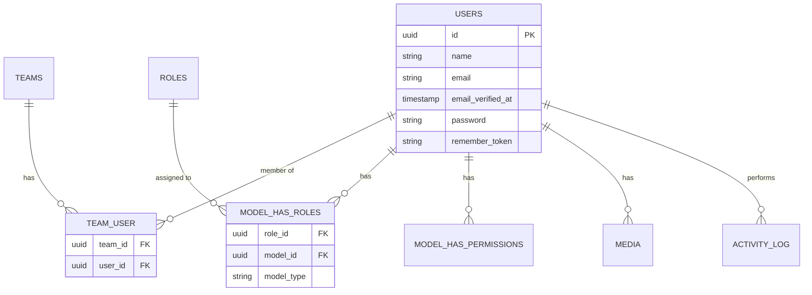

# Users Module

## Overview

The **Users** module provides the core user authentication and identity management for the recruitment system. It defines the User model which serves as the foundation for all user-related functionality across the application.

## Context

This module is the identity layer of the system. Users can be team members, hiring managers, interviewers, recruiters, or administrators. The User model integrates with multiple systems including authentication, permissions, teams, media management, and activity logging.

### Domain Position


## Model

### User

The core identity model for all system users.

| Property            | Type                 | Description             |
| ------------------- | -------------------- | ----------------------- |
| `id`                | UUID                 | Primary key             |
| `name`              | string               | Full name               |
| `email`             | string               | Email address (unique)  |
| `email_verified_at` | timestamp (nullable) | Email verification date |
| `password`          | string (hashed)      | Password hash           |
| `remember_token`    | string (nullable)    | Remember me token       |

**Relationships:**

- `belongsToMany` Team (via InteractsWithTenants)
- `belongsToMany` Role (via HasRoles)
- `belongsToMany` Permission (via HasRoles)
- `morphMany` Media (via InteractsWithMedia)

## Traits & Interfaces

The User model incorporates multiple traits and interfaces for extended functionality:

### Interfaces

| Interface      | Purpose                             |
| -------------- | ----------------------------------- |
| `FilamentUser` | Filament admin panel access control |
| `HasAvatar`    | Avatar URL for Filament             |
| `HasMedia`     | Spatie Media Library support        |

### Traits

| Trait                          | Source             | Purpose                      |
| ------------------------------ | ------------------ | ---------------------------- |
| `HasFactory`                   | Laravel            | Factory support for testing  |
| `HasRoles`                     | Spatie Permission  | Role & permission management |
| `HasUuids`                     | Laravel            | UUID primary keys            |
| `InteractsWithInterviewStages` | Recruitment        | Interview stage assignments  |
| `InteractsWithMedia`           | Spatie Media       | File attachments             |
| `InteractsWithTenants`         | Teams              | Multi-tenancy support        |
| `LogsActivity`                 | Spatie ActivityLog | Audit logging                |
| `Notifiable`                   | Laravel            | Notification support         |

## Integration Architecture


## Filament Panel Access

Users access the admin panel based on their roles:

```php
public function canAccessPanel(Panel $panel): bool
{
    return match ($panel->currentPanel()) {
        FilamentPanel::Admin => $this->hasRole(Roles::SuperAdmin),
        default => false,
    };
}
```

### Panel Access Matrix

| Panel              | Required Role | Access                     |
| ------------------ | ------------- | -------------------------- |
| Admin              | SuperAdmin    | Full system administration |
| (future) Recruiter | Recruiter     | Recruitment management     |
| (future) Candidate | -             | Candidate portal           |

## Avatar System

Users can have profile pictures managed via Spatie Media Library:

```php
// Get avatar URL for Filament
public function getFilamentAvatarUrl(): ?string
{
    $avatar = $this->getFirstMedia('profile-pictures');
    return $avatar?->getUrl();
}
```

Media collection: `profile-pictures`

## Entity Relationship Diagram



## Business Rules

### Authentication

1. **Email Unique**: Each user has a unique email address
2. **Password Hashing**: Passwords are automatically hashed
3. **Email Verification**: Optional email verification support
4. **Remember Me**: Token-based "remember me" functionality

### Authorization

1. **Role-Based**: Access controlled via Spatie Permission roles
2. **Panel Access**: Filament panel access determined by roles
3. **Policy-Based**: UserPolicy controls CRUD operations

### Multi-Tenancy

1. **Team Membership**: Users belong to one or more teams
2. **Tenant Scoping**: Data access scoped by current team
3. **Team Switching**: Users can switch between their teams

### Activity Logging

1. **Audit Trail**: All user actions can be logged
2. **Spatie Integration**: Uses Spatie ActivityLog package

## Directory Structure

```
users/
├── database/
│   ├── factories/
│   │   └── UserFactory.php
│   └── migrations/
│       └── 0001_01_01_000000_create_users_table.php
├── lang/
│   ├── en/
│   │   └── labels.php
│   └── pt_BR/
│       └── labels.php
├── src/
│   ├── User.php
│   ├── UserPolicy.php
│   └── UsersServiceProvider.php
└── tests/
    └── Feature/
        └── UserPolicyTest.php
```

## Usage Examples

### Creating a User

```php
$user = User::create([
    'name' => 'John Doe',
    'email' => 'john@example.com',
    'password' => 'secret123',
]);
```

### Assigning Roles

```php
use He4rt\Permissions\Roles;

$user->assignRole(Roles::SuperAdmin->value);
$user->assignRole('recruiter');
```

### Checking Permissions

```php
if ($user->can('create_applications')) {
    // User has permission
}

if ($user->hasRole(Roles::SuperAdmin)) {
    // User is super admin
}
```

### Managing Avatar

```php
// Upload avatar
$user->addMediaFromRequest('avatar')
    ->toMediaCollection('profile-pictures');

// Get avatar URL
$avatarUrl = $user->getFilamentAvatarUrl();
```

### Team Operations

```php
// Get user's teams
$teams = $user->teams;

// Check team membership
$user->teams()->where('id', $teamId)->exists();
```

## Security Considerations

1. **Hidden Attributes**: Password, remember_token, and email_verified_at are hidden from serialization
2. **Password Hashing**: Automatic via Laravel's `hashed` cast
3. **UUID Primary Keys**: Non-sequential IDs for security
4. **Policy Protection**: All operations protected by UserPolicy

## TODO / Future Enhancements

- [ ] Two-factor authentication
- [ ] Social login (OAuth)
- [ ] User preferences/settings
- [ ] Profile completion tracking
- [ ] User deactivation workflow
- [ ] Login history tracking
- [ ] Session management
- [ ] API tokens (Sanctum)
